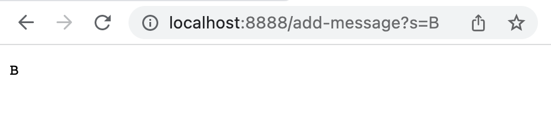
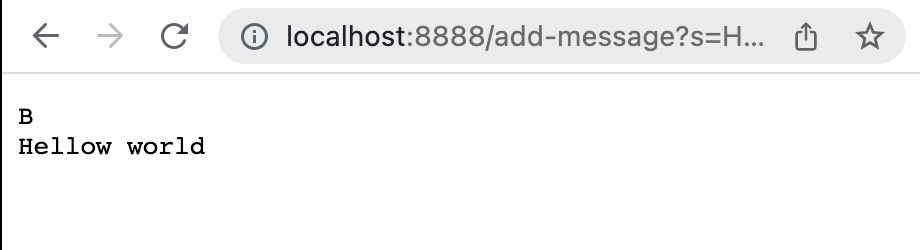

# CSE 15L Wi23 Lab Report 2

## Part1 

Server that allows for storing and printing strings given by the query of website: 

```
class Handler implements URLHandler {
    String str = "";
    public String handleRequest(URI url) {
        if (url.getPath().equals("/add-message")){
            String[] parameters = url.getQuery().split("=");
            if (parameters[0].equals("s")) {
                str = str +  parameters[1] + "\n";
                return str;
            }
        }
        return "404 error";
    }
}
```
### Adding and displaying a message:  



Methods called: `handleRequest()`; `url.getPath.equals()`; `url.getQuery().split()` 

Arguments: `handleRequest()` takes in the website url (as on top of the image above) as string; `url.getPath.equals()` compares the path of the url with the given string argument `"/add-message"` and returns true if same; `url.getQuery().split()` gets the query part from the url and split it into two strings with the argument `"="`, storing the strings in the parameters array. 

Changed values: 
`url` now stores `"localhost8888/add-message?s=B"`
`parameters` is initiliazed and set to [s, B]
`str` changed from `""` to `"B\n"`. 


### Adding and displaying the second message: 



The methods and Arguments are similar to those above: 

Methods called: `handleRequest()`; `url.getPath.equals()`; `url.getQuery().split()` 

Arguments: `handleRequest()` takes in the website url (as on top of the image above) as string; `url.getPath.equals()` compares the path of the url with the given string argument `"/add-message"` and returns true if same; `url.getQuery().split()` gets the query part from the url and split it into two strings with the argument `"="`, storing the strings in the parameters array. 

`url` now stores `"localhost8888/add-message?s=Hello world"`
`parameters` is initiliazed again and set to [s, Hello world]
The value in `str` is updated from `"B\n"` to `"B\nHello world\n"`. As str stores the original `"B\n"` from last call, and appends `"Hello world\n"` at the end to update the displayed string. 


<div style="page-break-after: always;"></div>

## Part2
`reverse` method in `ArrayTests` class:

### Faliure induce input with jUnit testing: 

```
import static org.junit.Assert.*;
import org.junit.*;

public class ArrayTests {
  @Test
  public void testReversed() {
    int[] input1 = {1, 2};
    assertArrayEquals(new int[]{ }, ArrayExamples.reversed(input1));
  }
}
```

### Input that doesn't induce a failure:

```
import static org.junit.Assert.*;
import org.junit.*;

public class ArrayTests {
  @Test
  public void testReversed() {
    int[] input1 = {0, 0};
    assertArrayEquals(new int[]{ }, ArrayExamples.reversed(input1));
  }
}
```

### Symptom: 

As shown in the image below, the method produced incorrect output with the input `[1, 2]`. After more testing, it is found that whatever input was given, the method will only return an array of zeros of the same length as the input array. 


### Bug: 

The bug in the code was that although a new variable `newArray` is declared to store the original input, it is not initialized to the input array and the elements remained zero. Below is an image of the code for the method. 


To fix the bug, the values in the input array `arr` need to be copied into `newArray`, so that when retrieving values from `newArray` in the reverse order won't give zeros. The fixed method is shown in the image below.


## Part3
I never knew how to set up a server that can be accessed through other computers. I also didn't knew the paths and queries existed, and that I could read them using java. I now learned how to set up servers using Java which can handle easy queries through different inputs in the url. 

