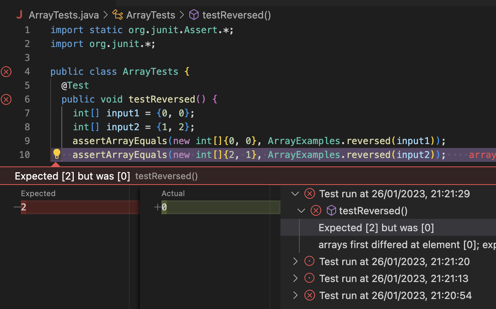
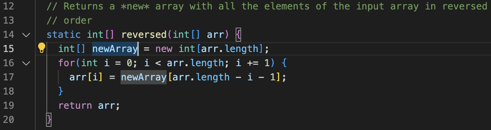
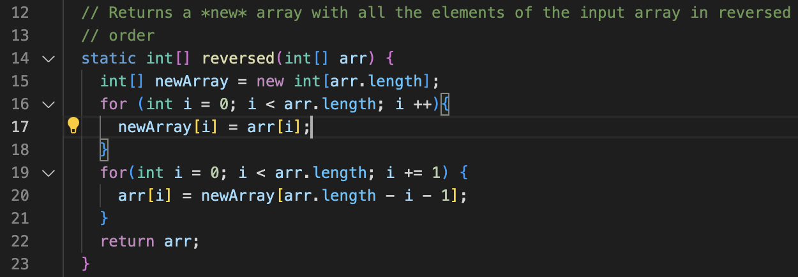

# CSE 15L Wi23 Lab Report 2

## Part1 


## Part2
`reverse` method in `ArrayTests` class:

### Faliure induce input with jUnit testing: 

```
import static org.junit.Assert.*;
import org.junit.*;

public class ArrayTests {
  @Test
  public void testReversed() {
    int[] input1 = {1, 2};
    assertArrayEquals(new int[]{ }, ArrayExamples.reversed(input1));
  }
}
```

### Input that doesn't induce a failure:

```
import static org.junit.Assert.*;
import org.junit.*;

public class ArrayTests {
  @Test
  public void testReversed() {
    int[] input1 = {0, 0};
    assertArrayEquals(new int[]{ }, ArrayExamples.reversed(input1));
  }
}
```

### Symptom: 

As shown in the image below, the method produced incorrect output with the input `[1, 2]`. After more testing, it is found that whatever input was given, the method will only return an array of zeros of the same length as the input array. 


### Bug: 

The bug in the code was that although a new variable `newArray` is declared to store the original input, it is not initialized to the input array and the elements remained zero. Below is an image of the code for the method. 



To fix the bug, the values in the input array `arr` need to be copied into `newArray`, so that when retrieving values from `newArray` in the reverse order won't give zeros. The fixed method is shown in the image below.



## Part3
I never knew how to set up a server that can be accessed through other computers. I also didn't knew the paths and queries existed, and that I could read them using java.

