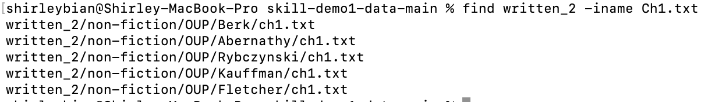
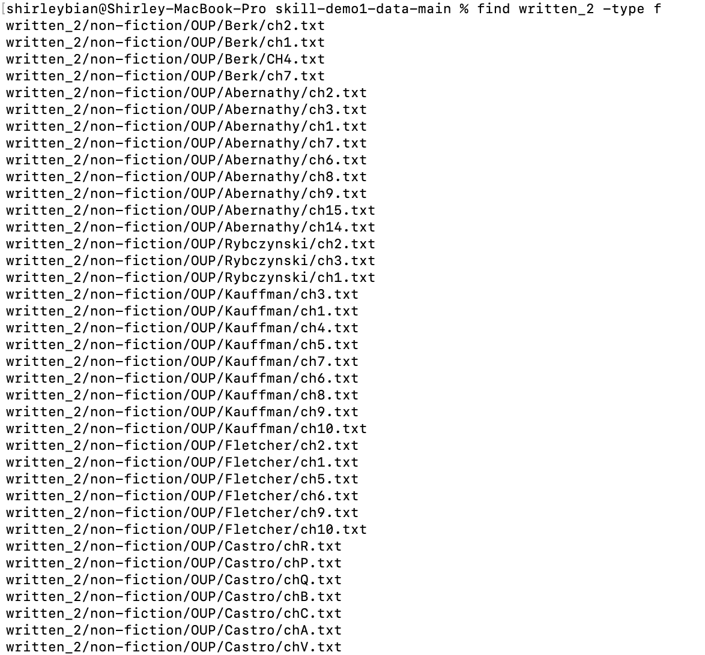
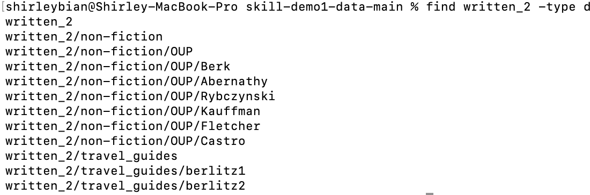
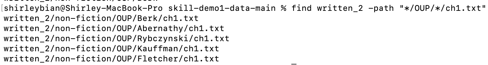
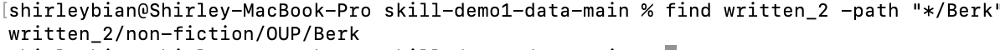
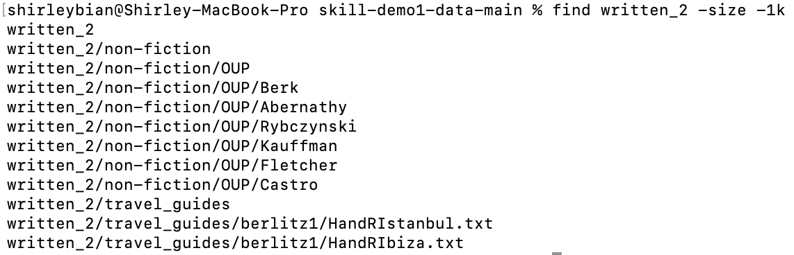
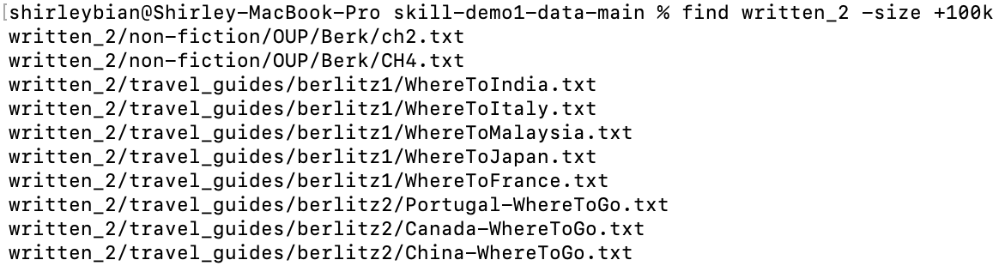

# CSE15L Lab Report 3

## Find

`find` - "searches the directory tree rooted at each given starting-point". 

Information retrived from: [https://man7.org/linux/man-pages/man1/find.1.html](https://man7.org/linux/man-pages/man1/find.1.html)

### -iname
The `iname` option behaves similar to `-name`, taking its following string as an argument, and searches for all files with names matching the given argument. Only that it is case insensitive when taking the argument for the file name. This option is useful as one can search for specified files with the given names insencitive to cases. 

Information retrived from: [https://man7.org/linux/man-pages/man1/find.1.html](https://man7.org/linux/man-pages/man1/find.1.html)

Using the `-iname` option in searching for a `.txt` file: 

Using the `-iname` option in searching for a directory: 

### -type
The `-type` option specifies the type of files found and returned. A few of the arguments include: f - regular file; d - directory. This is useful as when searching for files or directories, one may want to look for specific types of files. 

Information retrived from: [https://man7.org/linux/man-pages/man1/find.1.html](https://man7.org/linux/man-pages/man1/find.1.html)

Using the `-type` option in searching for all `.txt` files in the `written_2` directory

Using the `-type- option in searching for all directories in the `written_2` directory

### -path 
The `-path` option takes the argument as a path and find all files matching the given path. This is useful when parts of the path or directories are known but not the full path from the root directory. 

Information retrived from: [https://man7.org/linux/man-pages/man1/find.1.html](https://man7.org/linux/man-pages/man1/find.1.html)

Using the `-path` option in searching for `.txt` files in directoreis named `OUP`

Using the `-path` option in searching for directories named `Berk`

### -size 
The `-size` option specifies the size limits to the files and directories being searched for. This is useful when one's looking for files or directories within some range of sizes. 

Information retrived from: [https://man7.org/linux/man-pages/man1/find.1.html](https://man7.org/linux/man-pages/man1/find.1.html)

Using the `-size` option to find all files or directories with sizes smaller than 1 kibibyte: 

Using the `-size` option to find all files or directories with sizes greater than 100 kibibyte: 

