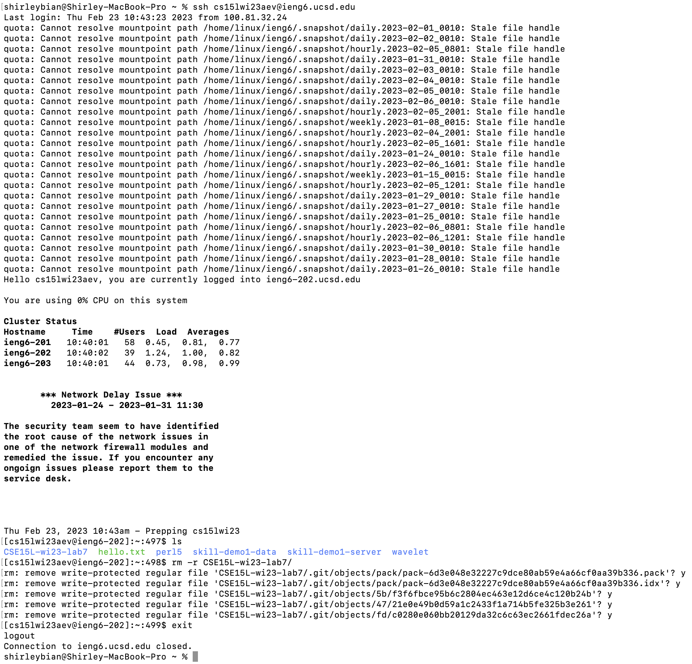
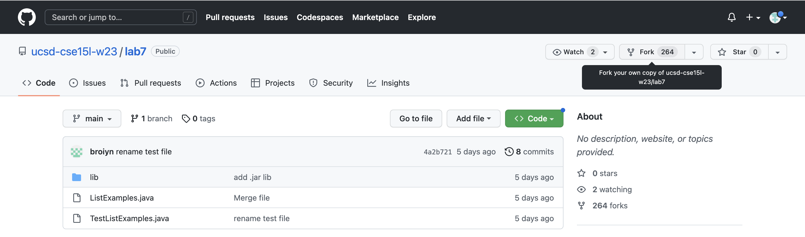
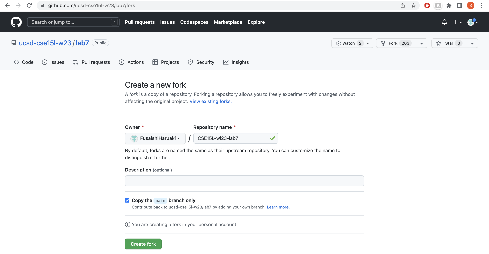
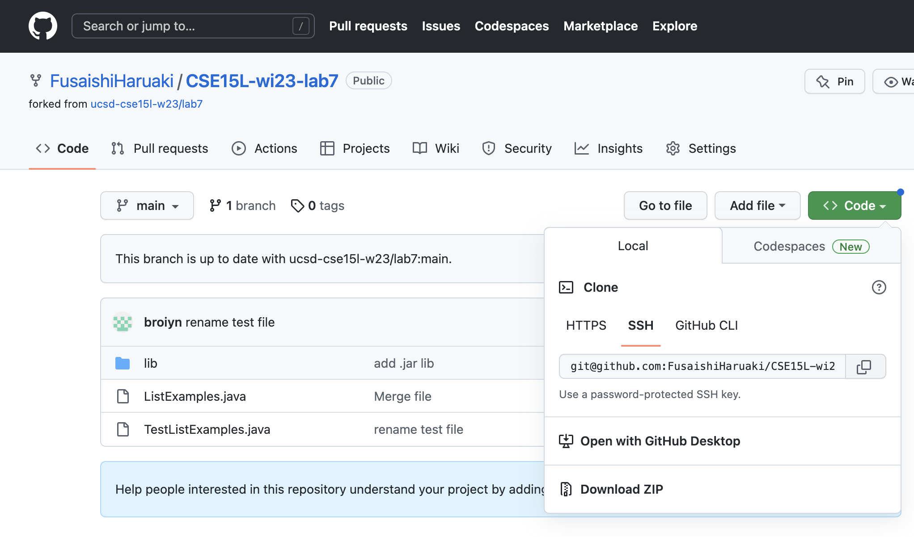
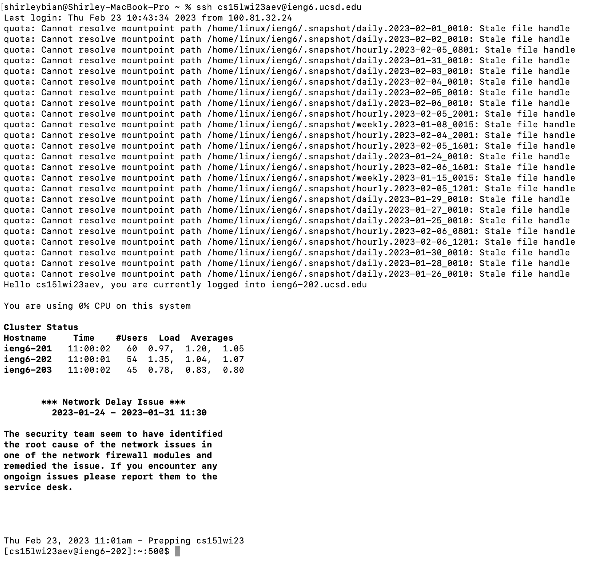
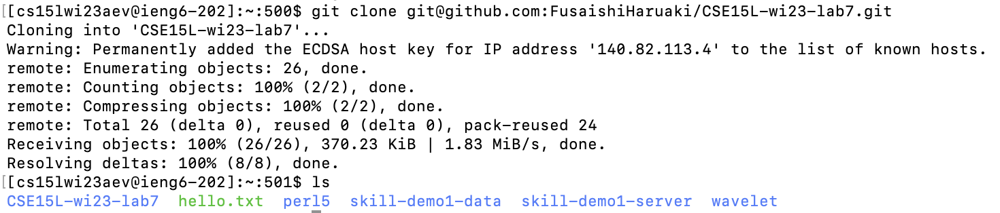
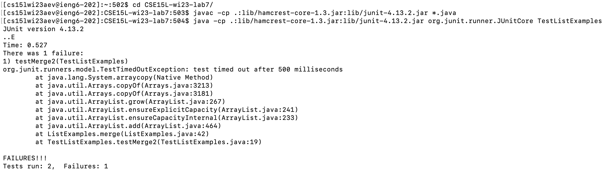
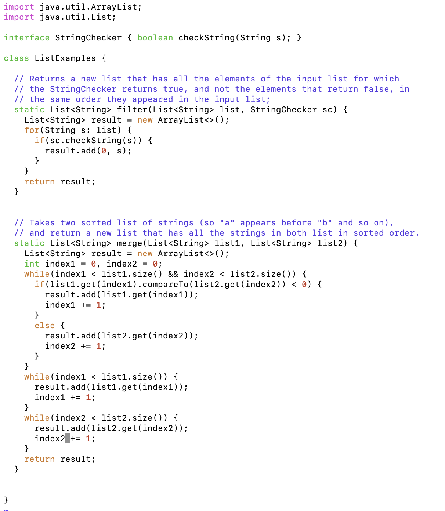
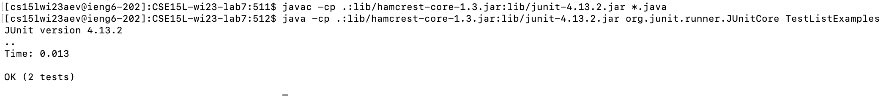
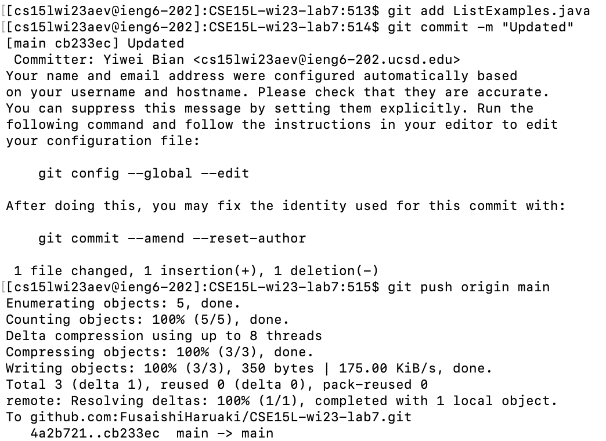

## 1. Setup Delete any existing forks of the repository you have on your account

`ssh cs15lwi23aev@ieng6.ucsd.edu<enter>` - Open terminal and log into the ieng6 account using the code. 

`ls<enter>` - Check if there are existing forks of the repository

`rm -r CSE<tab><enter> y<enter> y<enter> y<enter> y<enter> y<enter>` - Recursively remove all the files in the fork repository and answer yes to remove the files 

`exit<enter>` - to log out of ieng6

Screenshot: 

## 2. Setup Fork the repository
Through the github website [https://github.com/ucsd-cse15l-w23/lab7](https://github.com/ucsd-cse15l-w23/lab7), fork the repository through clicking on the fork button. 

Name the repository `CSE15L-wi23-lab7` and click `create fork`. 

To copy the link for cloning the repository, click on the green `code` button and the copy button next to the link. 

## 3. The real deal Start the timer!
google `timer` and press start

## 4. Log into ieng6
`ssh cs15lwi23aev@ieng6.ucsd.edu<enter>` - log into ieng6

## 5. Clone your fork of the repository from your Github account

`git clone <ctrl-C><enter>` - clone with the link copied from the forked repository. 

`ls<enter>` - show that the repository have been cloned to the remote machine. 

## 6. Run the tests, demonstrating that they fail

`cd CSE<tab><enter>` - cd into the cloned file. Use tab to auto complete the typing. 

`javac -cp .:lib/hamcrest-core-1.3.jar:lib/junit-4.13.2.jar *.java<enter>` - compile all java files in the repository

`java -cp .:lib/hamcrest-core-1.3.jar:lib/junit-4.13.2.jar org.junit.runner.JUnitCore TestListExamples<enter>` - run the JUnit tests. 

## 7. Edit the code file to fix the failing test

`vim L<tab><enter>` - open the file `ListExamples.java` through vim. 

`i` - go to insert mode in vim. 

`<down>` - repeat 42 times to get to the line that needs to be changed

`<shift-right> <shift-right><left> <delete> 2` - change the number of index from 1 to 2

`<esc>` - close insert mode 

`:wq` - save and exit vim

## 8. Run the tests, demonstrating that they now succeed

`<up><up><up><enter>` - move to the `javac` command in the history and compile the java files again

`<up><up><up><enter>` - move to the `java` command in the history and run the tests

## 9. Commit and push the resulting change to your Github account (you can pick any commit message!)

`git add L<tab>java` - use auto complete to add new changes of `ListExamples.java` file.

`git commit -m "Updated"` - commit the changes of the java files. 

`git push origin main` - push the changes to the GitHub repository

