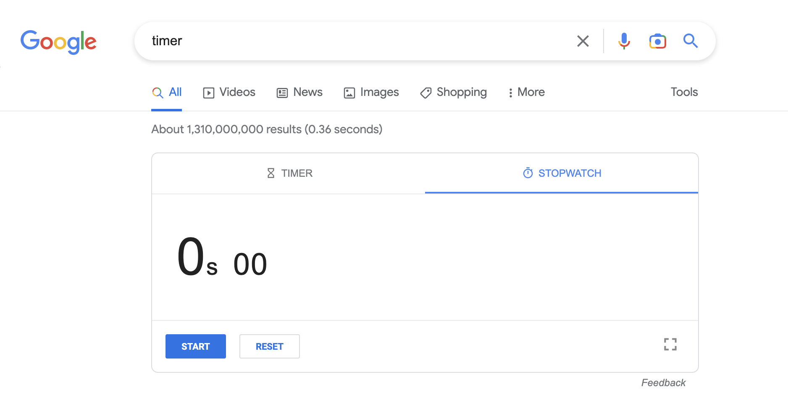

## 1. Setup Delete any existing forks of the repository you have on your account

`ssh cs15lwi23aev@ieng6.ucsd.edu` - Open terminal and log into the ieng6 account using the code. 

`ls` - Check if there are existing forks of the repository

`rm -r CSE<tab> y y y y y` - Recursively remove all the files in the fork repository and answer yes to remove the files 

`exit` - to log out of ieng6

Screenshot: 

## 2. Setup Fork the repository
Through the github website [https://github.com/ucsd-cse15l-w23/lab7](https://github.com/ucsd-cse15l-w23/lab7), fork the repository through clicking on the fork button. 

Name the repository `CSE15L-wi23-lab7` and click `create fork`. 

To copy the link for cloning the repository, click on the green `code` button and the copy button next to the link. 

## 3. The real deal Start the timer!
google `timer` and press start

## 4. Log into ieng6
`ssh cs15lwi23aev@ieng6.ucsd.edu` - log into ieng6

## 5. Clone your fork of the repository from your Github account

`git clone <ctrl-C>` - clone with the link copied from the forked repository. 
`ls` - show that the repository have been cloned to the remote machine. 

## 6. Run the tests, demonstrating that they fail

`cd CSE<tab>` - cd into the cloned file. Use tab to auto complete the typing. 

## 7. Edit the code file to fix the failing test

## 8. Run the tests, demonstrating that they now succeed

## 9. Commit and push the resulting change to your Github account (you can pick any commit message!)
