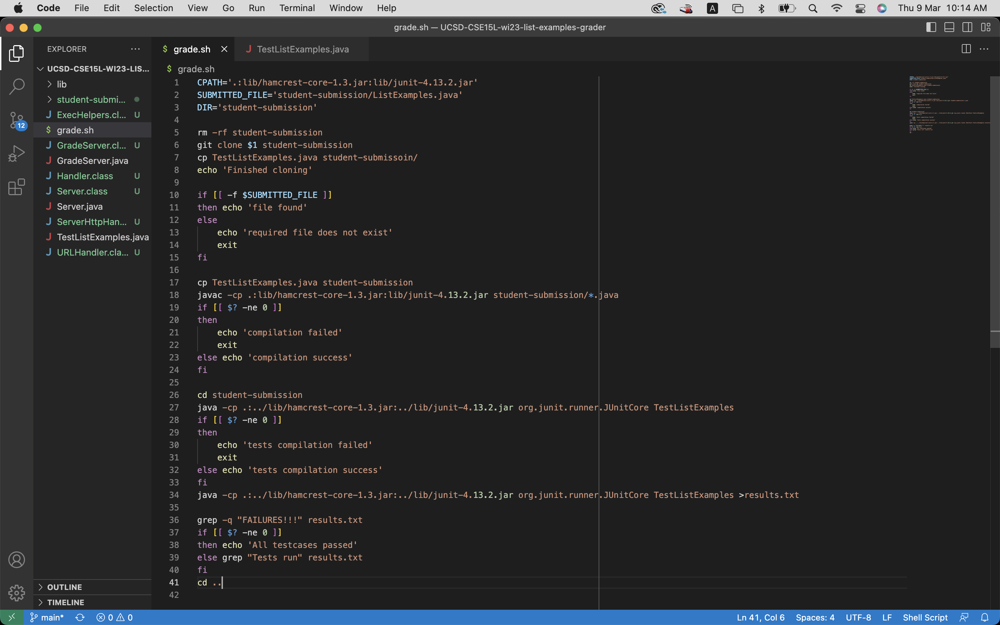
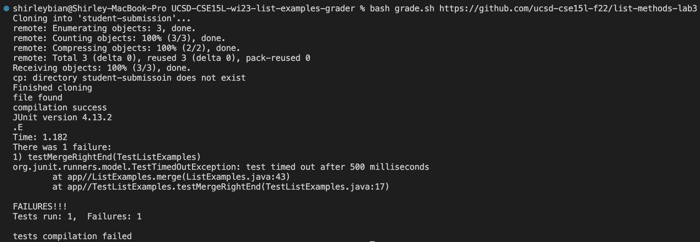
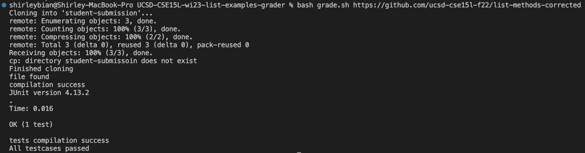
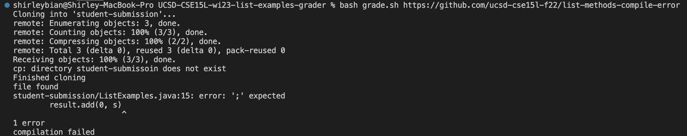
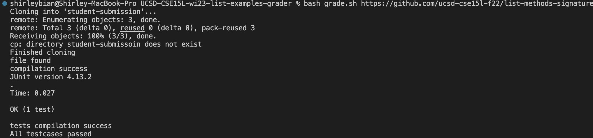
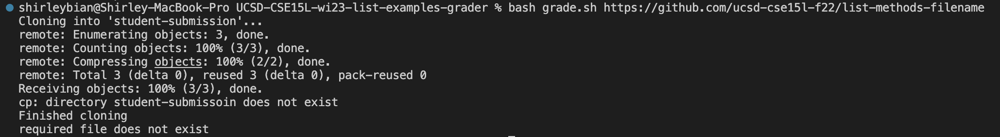
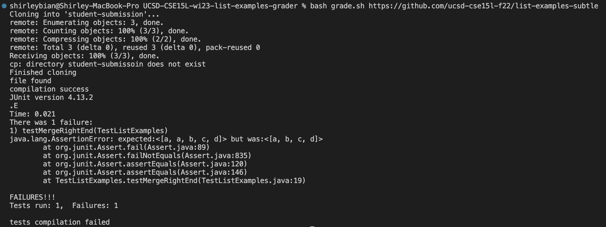

# Lab report 5
## Grading script

The bash file takes a git url, clone the repository, find and compile required files, and runs the JUnit tests to see if the program produces desired output. The script would inform whether the file is found, compiles successfully, and passes the provided JUnit tests. 

# Testcases: 

## https://github.com/ucsd-cse15l-f22/list-methods-lab3, which has the same code as the starter from lab 3

The desired file was found and compiled successfully. However, the program did not pass the JUnit test due to a time out exception. 

## https://github.com/ucsd-cse15l-f22/list-methods-corrected, which has the methods corrected (I would expect this to get full or near-to-full credit)

The desired file was found and compiled successfully. All provided test cases are passed. 

## https://github.com/ucsd-cse15l-f22/list-methods-compile-error, which has a syntax error of a missing semicolon. Note that your job is not to fix this, but to decide what to do in your grader with such a submission!

The desired file was found, but there was a compilation error. 

## https://github.com/ucsd-cse15l-f22/list-methods-signature, which has the types for the arguments of filter in the wrong order, so it doesn’t match the expected behavior.

The desired file was found and compiled successfully. Although it seemed that all provided tests were passed, the JUnit tests were not fully implemented and did not provide a thorough test. This is the tests still passed despite behaving differently than expected. 

## https://github.com/ucsd-cse15l-f22/list-methods-filename, which has a great implementation saved in a file with the wrong name.

The desired file was not found. The grading script is unable to detect files other than the designated name. 

## https://github.com/ucsd-cse15l-f22/list-methods-nested, which has a great implementation saved in a nested directory called pa1.

The desired file was not found. The grading script is unable to detect files in nested directory despite correct implementation. 

## Challenge https://github.com/ucsd-cse15l-f22/list-examples-subtle, which has more subtle bugs (hints: see assertSame, which compares with == rather than .equals(), and think hard about duplicates for merge)

The desired file was found and compiled successfully. However, the test cases did not pass. 

